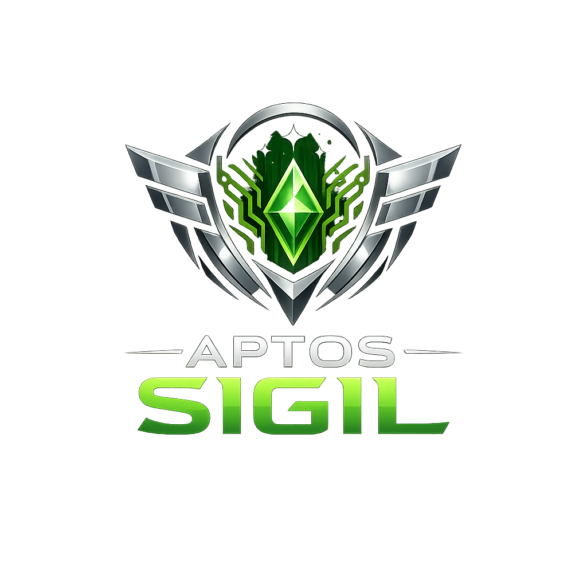
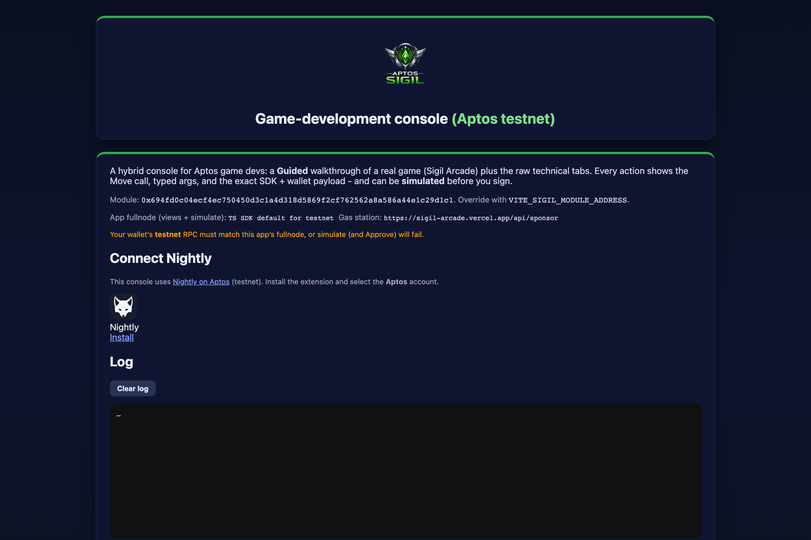
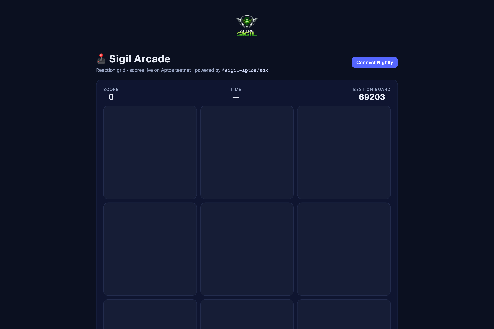
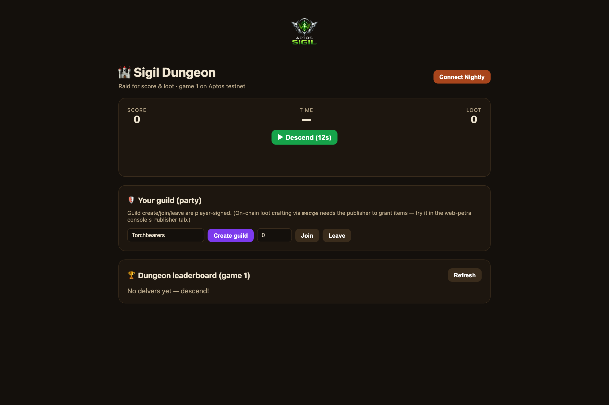
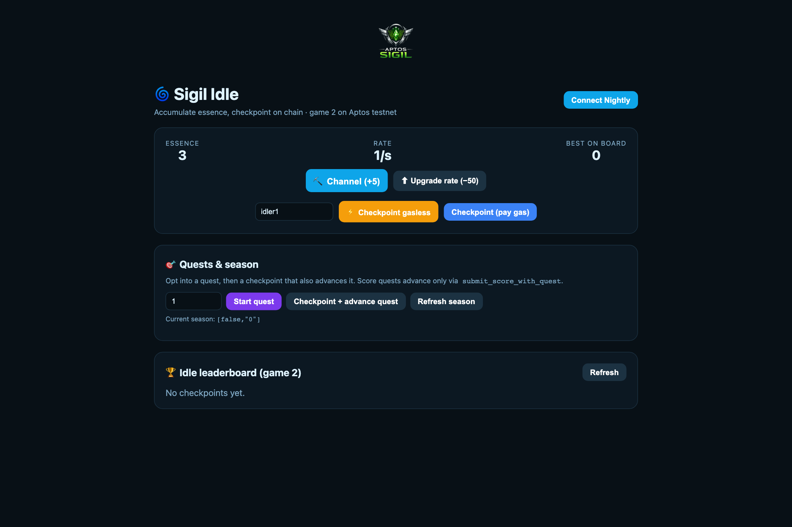

<p align="center">
  
</p>

<h1 align="center">Sigil — Gaming Platform on Aptos</h1>

<p align="center">
  <a href="https://opensource.org/licenses/MIT"></a>
  <a href="https://github.com/lopeselio/aptos-sigil/commits/master"></a>
  <a href="https://explorer.aptoslabs.com/account/0x694fd0c04ecf4ec750450d3c1a4d318d5869f2cf762562a8a586a44e1c29d1c1?network=testnet"></a>
</p>

**SIGIL — Signatures for In-Game Incentives & Leaderboards.** A complete, on-chain
gaming platform for Aptos: scores, leaderboards, achievements, rewards, quests,
seasons, guilds, item crafting, and a treasury — plus a TypeScript SDK and
**gasless (sponsored) transactions** so players never need to hold APT to play.

Anyone can be a **publisher**: each game creator gets their own independent
ecosystem under their own address.

---

## 🎮 Live demos

Everything below runs on **Aptos testnet** right now — connect the
[Nightly](https://nightly.app) wallet (set to Testnet) and play. Scores land on
chain, and you can submit them **gasless**.

| App | What it is | Link |
|-----|------------|------|
| 🛠️ **Game-development console** | A hybrid console: a guided walkthrough of a real game plus raw tools for every module. Each action shows the on-chain call + the SDK code, and can be simulated before you sign. | **[Open ▶](https://sigil-aptos-web-petra.vercel.app)** |
| 🕹️ **Sigil Arcade** | A reaction-grid mini-game. Tap the glowing tile, submit your score to the leaderboard. | **[Play ▶](https://sigil-arcade.vercel.app)** |
| 🏰 **Sigil Dungeon** | A timed “run” — strike for score and loot, with a guild (party) panel. | **[Play ▶](https://sigil-dungeon.vercel.app)** |
| 🌀 **Sigil Idle** | Accumulate essence over time, checkpoint it on chain, complete quests. | **[Play ▶](https://sigil-idle.vercel.app)** |

### What they look like

> Screenshots live in [`docs/assets/screenshots`](docs/assets/screenshots). Use the live links above to see them in action.

**Console**



**The three games**

<p>
  
  
  
</p>

---

## ✨ Capabilities

- **Games & players** — publishers register games; players are created on their first score (no separate signup).
- **Leaderboards** — ranked top-N per game, configurable sort/precision/retention.
- **Achievements** — flexible unlock conditions (score thresholds, consistency, play counts, combos, game-specific) with optional badge art.
- **Automatic rewards** — attach an APT (fungible) or NFT reward to an achievement; players claim it in a single transaction, distributed from a resource account with no backend.
- **Quests** — opt-in missions (score, achievement, play-count, streak, rank, multi-step) with claimable rewards.
- **Seasons** — time-bounded competitions over a leaderboard with prize pools and finalization.
- **Guilds** — lightweight on-chain teams (create / join / leave).
- **Item crafting (merge)** — publisher-defined recipes that consume inputs to mint outputs.
- **Treasury** — fungible-asset vault for funding payouts.
- **Multi-admin roles** — owner / admin / operator permissions so teams can manage a game safely.
- **Anti-cheat (attest)** — optional server-signed score attestations.
- **Gasless gameplay** — sponsored (fee-payer) transactions and session keys, so players pay 0 APT.

---

## 👥 Who can use Sigil?

| Role | What they do | Access |
|------|--------------|--------|
| **Publisher** | Deploys/owns a game ecosystem: registers games, creates leaderboards, achievements, rewards, quests, seasons. | Owns the module address (or is the configured owner). |
| **Admin / Operator** | Team members the publisher grants scoped permissions to (manage rewards, leaderboards, treasury, etc.). | Granted via the **roles** module. |
| **Player** | Plays games, submits scores, unlocks achievements, claims rewards, joins guilds, takes on quests. | Anyone with a wallet — and with gasless, **no APT required**. |
| **App developer** | Builds games/apps on top using the TypeScript SDK. | `@sigil-aptos/sdk` (see below). |

---

## 📍 Deployed contracts (Aptos testnet)

Testnet is the stable home (devnet wipes ~weekly). The package is live at the
**publisher address** below, with games **0 (Arcade)**, **1 (Dungeon)**, and
**2 (Idle)** plus their leaderboards registered.

| | Address |
|--|---------|
| **Publisher / module** | [`0x694fd0c04ecf4ec750450d3c1a4d318d5869f2cf762562a8a586a44e1c29d1c1`](https://explorer.aptoslabs.com/account/0x694fd0c04ecf4ec750450d3c1a4d318d5869f2cf762562a8a586a44e1c29d1c1?network=testnet) |
| **Gas-station fee payer** (sponsors gasless txns) | [`0xe2a6706b01ecd5188a97e35f260ffec6bb8b1a4d87b005396b91d813705a407a`](https://explorer.aptoslabs.com/account/0xe2a6706b01ecd5188a97e35f260ffec6bb8b1a4d87b005396b91d813705a407a?network=testnet) |

### The modules

All modules are published under `sigil::<module>` at the publisher address.

| Module | What it stands for |
|--------|--------------------|
| **game_platform** | The core: registers games, creates players (lazily on first score), records scores. |
| **leaderboard** | Per-game ranked top-N boards; `submit_score` updates them automatically. |
| **achievements** | Achievement catalog with flexible unlock conditions + badge art. |
| **rewards** | Attaches APT/NFT rewards to achievements; one-transaction claiming from a resource account. |
| **quests** | Mission system (6 quest types) with claimable rewards. |
| **seasons** | Time-bounded competitions over a leaderboard, with prize pools and finalization. |
| **guilds** | Lightweight on-chain teams per publisher. |
| **merge** | Crafting: recipes that consume input items to produce outputs. |
| **treasury** | Fungible-asset vault for funding rewards and payouts. |
| **roles** | Owner / admin / operator permissions for team management. |
| **attest** | Server-side score attestation (anti-cheat). |
| **shadow_signers** | Session keys: temporary delegated authorization for popup-free gameplay. |

---

## ⚡ Gasless / sponsored transactions

Players should never need to hold APT to play. Sigil supports **fee-payer
(sponsored) transactions**: the player still authorizes the action from their
wallet, but a separate **gas station** account pays the gas.

- It's an Aptos L1 feature — **no contract changes** required.
- The three games each ship a small `/api/sponsor` gas-station endpoint; the
  console can point at one too. The fee payer is set via a **server-side** secret
  (`SPONSOR_PRIVATE_KEY`) — never exposed to the browser.
- Swap in your **own** funded account's key to sponsor for your own app, and keep
  an **allowlist** so the endpoint only pays for your module's calls.

Browser flow (via the SDK):

```ts
import { buildSponsoredTransaction, requestSponsorship, submitSponsored } from "@sigil-aptos/sdk";

const tx = await buildSponsoredTransaction({ aptos, sender: account.address, data: payload.data });
const { authenticator: senderAuthenticator } = await signTransaction({ transactionOrPayload: tx });
const { feePayerAuthenticator, feePayerAddress } = await requestSponsorship({ endpoint: "/api/sponsor", transaction: tx });
await submitSponsored({ aptos, transaction: tx, senderAuthenticator, feePayerAuthenticator, feePayerAddress });
```

A complementary mechanism, **session keys** (`shadow_signers`), lets a player
delegate scoped, time-limited signing so a game can submit on their behalf
without a wallet popup each time.

---

## 🧰 TypeScript SDK & the three example games

The [`@sigil-aptos/sdk`](sdk/typescript) package gives typed, wallet-signable
helpers for every module — `walletPayload*` (browser), `build*` (server signer),
and `view*` (reads) — plus the sponsored-transaction helpers.

```bash
npm install @sigil-aptos/sdk @aptos-labs/ts-sdk
```

```ts
import { AccountAddress, Network } from "@aptos-labs/ts-sdk";
import { SigilClient, createAptosClient } from "@sigil-aptos/sdk";

const sigil = new SigilClient({
  aptos: createAptosClient({ network: Network.TESTNET }),
  moduleAddress: AccountAddress.from("0x694fd0c04ecf4ec750450d3c1a4d318d5869f2cf762562a8a586a44e1c29d1c1"),
});

// First submit auto-registers the player + sets a username — one transaction:
const payload = sigil.gamePlatform.walletPayloadSubmitScore({ gameId: 0n, score: 1000n, username: "player1" });
await signAndSubmitTransaction(payload); // from @aptos-labs/wallet-adapter-react
```

**Three apps built on the SDK** (all in [`sdk/typescript/examples`](sdk/typescript/examples)):

- **Sigil Arcade** ([`games/arcade`](sdk/typescript/examples/games/arcade)) — game 0. A reaction grid → score → leaderboard, with gasless submission.
- **Sigil Dungeon** ([`games/dungeon`](sdk/typescript/examples/games/dungeon)) — game 1. Timed runs + loot + guilds.
- **Sigil Idle** ([`games/idle`](sdk/typescript/examples/games/idle)) — game 2. Accumulate + checkpoint + quests/seasons.

Plus the **game-development console** ([`web-petra`](sdk/typescript/examples/web-petra))
and a step-by-step [tutorial](docs/tutorial/building-a-game-on-aptos.md).

### Run an app locally

```bash
# build the SDK once
cd sdk/typescript && npm install && npm run build

# a game (serves its own gas station for gasless):
cd examples/games/arcade && cp .env.example .env.local   # set SPONSOR_PRIVATE_KEY for gasless
npm install && npm run dev                                # http://localhost:3000

# the console:
cd ../../web-petra && cp .env.example .env.local
npm install && npm run dev                                # http://localhost:5173
```

> The example `.env.example` files default to the testnet module above. Set
> `SPONSOR_PRIVATE_KEY` to a **funded** account's key (server-side only) to enable
> gasless. Never commit `.env.local`.

---

## 🛠️ Game-development console

The console ([live](https://sigil-aptos-web-petra.vercel.app)) is a hybrid
learning + reference surface for first-time Aptos game devs:

- **Guided** tab — walks a real game's player lifecycle (open → first score →
  leaderboard → quest → reward → guild → season), explaining the *why* of each step.
- **Player / Publisher / Views** tabs — raw access to every module's calls.
- For every action: **Inspect** (the exact on-chain call, typed arguments, and the
  SDK + wallet payload to copy), **Simulate** (a free dry-run before you sign),
  **Run**, and **⚡ Gasless** where a sponsor applies.


---

## 🔐 Multi-admin management with roles

Games are run by teams, not just one key. The **roles** module gives each
publisher a permission hierarchy:

- **Owner** — the publisher; full control, cannot be removed.
- **Admin** — can manage most things and grant/revoke operators.
- **Operator** — scoped permissions for day-to-day actions.

Capability checks the platform uses internally:

```
is_owner · is_admin · is_operator · is_authorized
can_manage_achievements · can_manage_rewards · can_manage_leaderboards
can_manage_treasury · can_manage_roles
```

Typical flow: the owner calls `roles::init_roles`, then `add_admin` / `add_operator`
to delegate. Module actions (e.g. attaching a reward, creating a leaderboard) then
accept an authorized admin/operator — not just the owner.

---

## ✅ Prerequisites

- **[Aptos CLI](https://aptos.dev/tools/aptos-cli/)** — to compile/deploy/test the Move package.
- **Node.js ≥ 20** and **npm** — for the SDK and example apps.
- A browser wallet — **[Nightly](https://nightly.app)** (Aptos) is what the apps use; set it to **Testnet**.
- (Optional) a Vercel account — to host an app + its gas station.

---

## 🚀 Deploying the contracts

The package address is **overridable**: `Move.toml` sets `sigil = "_"` so you can
publish to any account/network with `--named-addresses sigil=<addr>` (a
`[dev-addresses]` value lets `aptos move test` run with no flags).

### Testnet (recommended — persistent, free)

```bash
# 1. Create + fund a publisher profile (testnet faucet is a web captcha)
cd move && aptos init --profile testnet --network testnet
#    fund it: https://aptos.dev/network/faucet?address=<your-address>

# 2. Publish + initialize all modules + register game 0 / leaderboard 0
cd .. && APTOS_PROFILE=testnet ./scripts/redeploy_testnet.sh

# 3. Verify
aptos move view --profile testnet \
  --function-id <addr>::game_platform::game_count --args address:<addr>
```

### Devnet (wipes ~weekly)

Devnet resets roughly weekly, removing all state. To restore a working deployment
in one command (fund → publish → init → register a game):

```bash
./scripts/redeploy_devnet.sh
```

Full deployment runbook (accounts, funding, app wiring, gas-station secret):
[`docs/DEPLOYMENT_TESTNET.md`](docs/DEPLOYMENT_TESTNET.md).

---

## 🧪 Smoke tests, example workflows & scripts

Scripts in [`scripts/`](scripts):

| Script | What it does |
|--------|--------------|
| `redeploy_testnet.sh` | Publish + init all modules + register game 0 on testnet (profile-overridable). |
| `redeploy_devnet.sh` | Same for devnet (fund → publish → init → register). |
| `devnet_quick_module_smoke.sh` | Touch every module with minimal transactions (inits, register game, create leaderboard, submit score, quest, guild, recipe, treasury deposit). |
| `devnet_deeper_onchain_smoke.sh` | A deeper end-to-end pass. |
| `devnet_season_payout_smoke.sh` | Full season create → start → end → finalize → payout. |
| `setup_petra_player_cli_profile.sh` | Set up a player CLI profile for manual testing. |
| `sync-logo.sh` | Distribute the brand logo into every app. |

SDK example workflows ([`sdk/typescript`](sdk/typescript)):

```bash
cd sdk/typescript
# Gasless submit_score proven from a zero-balance account (needs a funded sponsor key):
SPONSOR_PRIVATE_KEY=<funded-key> SIGIL_MODULE_ADDRESS=<addr> npm run example:sponsored-smoke
# Broader read/write smoke:
SIGIL_PUBLISHER_PRIVATE_KEY=<key> npm run example:deeper-smoke
```

> Replace `<...>` placeholders with your own values. **Never** paste real private
> keys into committed files — pass them via the environment only.

---

## 🔬 Running tests

```bash
# Move unit tests (no extra flags — resolves the address from [dev-addresses])
aptos move test --package-dir move

# TypeScript SDK tests
cd sdk/typescript && npm install && npm test
```

---

## 🧱 Data structures (by module)

Core on-chain state for each module (events omitted for brevity).

**game_platform**
```move
struct Game   { id: u64, title: String, creator: address }
struct Player { user: address, username: String }
```

**leaderboard**
```move
struct Config {
  game_id: u64, decimals: u8, min_score: u64, max_score: u64,
  is_ascending: bool,        // true => lower is better
  allow_multiple: bool,      // false => keep only each player's best
  scores_to_retain: u64,     // top-N to keep
}
```

**achievements**
```move
struct Achievement { id: u64, title: vector<u8>, description: vector<u8>,
                     condition: Condition, badge_uri: Option<vector<u8>> }
```

**rewards**
```move
struct Reward { achievement_id: u64, kind: RewardKind,   // FA or NFT
                total_supply: u64, claimed_count: u64 }   // 0 supply = unlimited
```

**quests**
```move
struct Quest { id: u64, title: String, description: String, quest_type: u8,
               game_id: u64, target: u64, leaderboard_id: u64, steps: vector<u64>,
               reward_id: u64, season_id: Option<u64>, is_active: bool, created_at: u64 }
struct QuestProgress { quest_id: u64, current_progress: u64, completed: bool,
                       claimed: bool, started_at: u64, completed_at: u64, last_update_day: u64 }
```

**seasons**
```move
struct Season { id: u64, name: String, start_time: u64, end_time: u64,
                leaderboard_id: u64, achievement_ids: vector<u64>,
                prize_pool: u64, is_finalized: bool }
```

**guilds**
```move
struct Guild { id: u64, name: String, leader: address, members: vector<address> }
```

**merge**
```move
struct Recipe { id: u64, input_item_id: u64, input_qty: u64,
                output_item_id: u64, output_qty: u64 }
```

**roles**
```move
struct Roles { owner: address, roles: Table<address, u8>, events: RoleEvents }
```

**treasury**
```move
struct Treasury { publisher: address, tracking: Table<address, FATracking>, events: TreasuryEvents }
```

**shadow_signers** (session keys)
```move
struct Session { authority: address, pubkey: vector<u8>, scopes: vector<vector<u8>>,
                 expires_at_secs: u64, revoked: bool, last_nonce: u64, fee_payer: address }
```

**attest**
```move
struct AttestConfig { publisher: address, server_pubkey: vector<u8>,
                      nonces: Table<address, u64>, max_age_secs: u64, events: AttestEvents }
```

---

## ❗ Error codes (by module)

Abort codes you may see (the `vm_status` shows `module::E_NAME`).

| Module | Codes |
|--------|-------|
| **game_platform** | `0` ALREADY_INIT · `1` GAME_NOT_FOUND · `4` INVALID_ATTESTATION |
| **leaderboard** | `0` ALREADY_INIT · `1` NOT_FOUND · `2` ID_EXISTS · `4` NO_PERMISSION · `5` GAME_ALREADY_HAS_LEADERBOARD |
| **achievements** | `0` ALREADY_INIT · `1` NOT_FOUND · `2` EXISTS · `3` NO_PERMISSION |
| **rewards** | `0` ALREADY_INIT · `1` NOT_FOUND · `2` ALREADY_ATTACHED · `3` ACHIEVEMENT_NOT_UNLOCKED · `4` ALREADY_CLAIMED · `5` OUT_OF_STOCK · `6` INVALID_SUPPLY · `7` NOT_INITIALIZED · `8` NO_PERMISSION |
| **quests** | `0` NOT_INITIALIZED · `1` ALREADY_INITIALIZED · `2` QUEST_NOT_FOUND · `3` QUEST_NOT_STARTED · `4` QUEST_ALREADY_COMPLETED · `5` QUEST_NOT_AVAILABLE · `6` INVALID_QUEST_TYPE · `7` NO_PERMISSION · `8` ALREADY_STARTED · `9` QUEST_NOT_COMPLETED · `10` REWARD_ALREADY_CLAIMED · `11` NO_QUEST_REWARD |
| **seasons** | `0` NOT_INITIALIZED · `1` ALREADY_INITIALIZED · `2` SEASON_NOT_FOUND · `3` ALREADY_STARTED · `4` NOT_STARTED · `5` ENDED · `6` INVALID_DURATION · `7` NO_PERMISSION · `8` ALREADY_FINALIZED · `9` CANNOT_FINALIZE_YET · `10` PUBLISHER_MUST_SIGN · `11` TREASURY_NOT_INITIALIZED · `12` INVALID_PAYOUT_CONFIG · `13` ZERO_PRIZE_POOL · `14` NO_WINNERS · `15` PAYOUT_ROUNDED_TO_ZERO |
| **guilds** | `0` NOT_INITIALIZED · `1` ALREADY_INITIALIZED · `2` GUILD_NOT_FOUND · `3` ALREADY_IN_GUILD · `4` GUILD_FULL · `5` NOT_IN_GUILD · `6` NO_PERMISSION · `7` NOT_MEMBER |
| **merge** | `0` NOT_INITIALIZED · `1` ALREADY_INITIALIZED · `2` RECIPE_NOT_FOUND · `3` INSUFFICIENT_ITEMS · `4` NO_PERMISSION · `5` INVALID_QUANTITY |
| **treasury** | `0` NOT_INITIALIZED · `1` ALREADY_INITIALIZED · `2` INSUFFICIENT_BALANCE · `3` INVALID_AMOUNT · `4` WITHDRAWAL_TOO_LARGE · `5` NOT_PUBLISHER · `6` STORE_NOT_FOUND |
| **roles** | `0` ALREADY_INIT · `1` NOT_INITIALIZED · `2` NOT_OWNER · `3` NOT_ADMIN · `4` NO_PERMISSION · `5` ALREADY_HAS_ROLE · `6` DOES_NOT_HAVE_ROLE · `7` CANNOT_MODIFY_OWNER |
| **attest** | `0` NOT_INITIALIZED · `1` ALREADY_INITIALIZED · `2` INVALID_SIGNATURE · `3` ATTESTATION_TOO_OLD · `4` INVALID_NONCE · `5` INVALID_PUBKEY_LENGTH |
| **shadow_signers** | `0` NOT_INITIALIZED · `1` ALREADY_INITIALIZED · `2` SESSION_NOT_FOUND · `3` SESSION_EXPIRED · `4` SESSION_REVOKED · `5` INVALID_TTL · `6` INVALID_SIGNATURE · `7` SCOPE_NOT_ALLOWED · `8` INVALID_MESSAGE · `9` INVALID_NONCE · `10` INVALID_PUBKEY_LENGTH · `11` NOT_AUTHORITY |

---

## 🩺 Troubleshooting

| Symptom | Cause & fix |
|--------|-------------|
| **`Unauthorized` / "not valid JSON"** on reads | Your RPC API key is for the wrong network (e.g. devnet key on testnet) → the node returns 401. **Unset the API key** to use the public testnet node anonymously, or use a testnet-scoped key. Restart the dev server (env is read at startup). |
| **`module_not_found`** | Devnet was wiped, or you're pointed at the wrong address/network. Re-deploy (`redeploy_*.sh`) or fix the module address. |
| **Wallet "Approve" stays disabled / hangs** | Your wallet's network RPC doesn't match the app's. Set the wallet to the **same** network/RPC the app uses. |
| **⚡ Gasless fails** ("gas station…") | No gas station running, or `SPONSOR_PRIVATE_KEY` not set / unfunded. Run a game (serves `/api/sponsor`) or point `*_SPONSOR_ENDPOINT` at a deployed one, and keep the fee payer funded. |
| **An admin call aborts `NO_PERMISSION`** | The connected wallet isn't the publisher or an authorized admin/operator for that module. Connect as the owner or grant a role. |
| **`create_leaderboard` aborts** | A leaderboard already exists for that `game_id` (`GAME_ALREADY_HAS_LEADERBOARD`). Use a new game or the existing board. |
| **Testnet faucet "must visit the web faucet"** | The CLI faucet is disabled on testnet; fund via [the web faucet](https://aptos.dev/network/faucet) or transfer from a funded account. |

---

## 📜 License

MIT — see [LICENSE](sdk/typescript/LICENSE).

## 🤝 Contributing

Contributions welcome. Install the Aptos CLI + Node, run `aptos move test` and the
SDK tests, make your change, and open a PR.

## 📧 Contact

Questions or support: please [open an issue](https://github.com/lopeselio/aptos-sigil/issues) on GitHub.

---

<p align="center"><strong>Built with ❤️ for the Aptos gaming ecosystem</strong></p>

<p align="center">
  <em>Last updated:</em>
  <a href="https://github.com/lopeselio/aptos-sigil/commits/master"></a>
  <em>(auto-tracked from the latest commit)</em>
</p>
